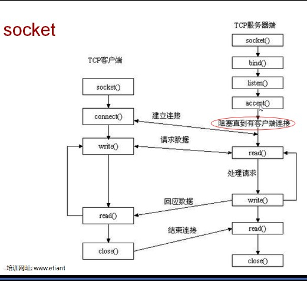

#Learn Python Socket programming summary

##Socket 相关方法
###服务器端socket
| 方法 | 作用 |
| :------: |:------: |
|s.bind()|	绑定地址（host,port）到套接字， 在AF_INET下,以元组（host,port）的形式表示地址。 
|s.listen()|开始TCP监听。backlog指定在拒绝连接之前，操作系统可以挂起的最大连接数量。该值至少为1，大部分应用程序设为5就可以了。|
|s.accept()|被动接受TCP客户端连接,(阻塞式)等待连接的到来|
###客户端socket
| 方法 | 作用 |
| :------: |:------: |
|s.connect()|主动初始化TCP服务器连接，。一般address的格式为元组（hostname,port），如果连接出错，返回socket.error错误。|
|s.recv()|接收TCP数据，数据以字符串形式返回，bufsize指定要接收的最大数据量。flag提供有关消息的其他信息，通常可以忽略。| 
|s.send()|发送TCP数据，将string中的数据发送到连接的套接字。返回值是要发送的字节数量，该数量可能小于string的字节大小。| 
|s.recvfrom()|接收UDP数据，与recv()类似，但返回值是（data,address）。其中data是包含接收数据的字符串，address是发送数据的套接字地址。| 
|s.sendto()|发送UDP数据，将数据发送到套接字，address是形式为（ipaddr，port）的元组，指定远程地址。返回值是发送的字节数。| 
|s.close()|关闭套接字| 
	
#服务器支持多客户端连接以及io复用	
	
	
	
	
